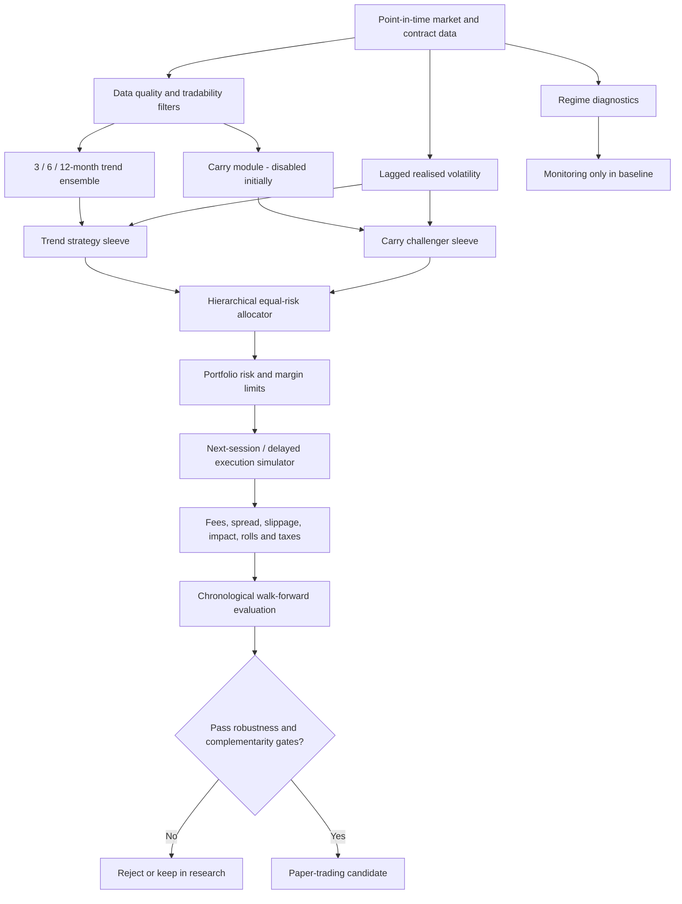

# Systematic Trading Research: Evidence, Strategy Selection and Implementation Handoff

## Executive summary

The topic is no longer genuinely unspecified. The three uploaded research briefs define it as a quantitative-research programme whose central question is: **which systematic trading strategy, or complementary combination of strategies, is sufficiently evidence-based, robust and implementable to hand to a separate AI for construction and rigorous testing?** The briefs explicitly require failure-first research, realistic costs, market-specific analysis, complementarity, out-of-sample validation and a separation between research and engineering. fileciteturn0file0 fileciteturn0file1 fileciteturn0file2

**Research conclusion:** the evidence does **not** support building an “AI trading bot” around a stack of RSI, MACD, moving averages, Bollinger Bands and similar indicators, nor does it justify beginning with deep learning or reinforcement learning. The most defensible first implementation target is a **simple, diversified, medium-horizon multi-asset time-series momentum/trend-following system**, operating on daily data, with volatility-normalised positions and conservative portfolio-level risk controls. Time-series momentum has unusually broad evidence: the seminal study documented return persistence over roughly one to twelve months across 58 liquid futures spanning equity indices, currencies, commodities and bonds, while a much longer historical reconstruction found positive average trend-following returns in every decade from 1880 and favourable behaviour in eight of ten major stock/bond crisis periods. citeturn0search5turn14view3

That evidence should **not** be mistaken for universality. A 2026 *Financial Management* study using US data through December 2024 and an international sample of 20 countries found that equity time-series momentum became unreliable near historical extremes in equity and bond valuations. This is important negative evidence: trend should be treated as a persistent but regime-dependent research hypothesis, not an immutable law. citeturn14view5turn14view6

The best **complementary strategy to build as a disabled research sleeve** is **cross-asset carry**. Carry has peer-reviewed evidence across several asset classes, but its bad periods are associated with global recession, liquidity and volatility risks; therefore it should be activated only if an independent implementation demonstrates genuinely low conditional correlation and lower portfolio drawdowns after costs. citeturn2search0turn2search2 An alternative second-stage diversifier, where reliable point-in-time equity fundamentals are available, is a **slow value-plus-profitability sleeve**: value and momentum have historically been negatively correlated across markets and asset classes, while gross profitability has independently predicted the cross-section of stock returns. citeturn15view0turn15view1

Cross-sectional equity momentum remains a legitimate research candidate, including for India, but it is **not an obvious diversifier to trend** because both load on momentum-like persistence and equity momentum is vulnerable to severe rebound/crash states. The classic momentum literature establishes the anomaly, while Daniel and Moskowitz document the crash problem; Indian studies also find momentum in BSE samples but, appropriately, imply that India must be tested independently rather than inferred from US evidence. citeturn0search0turn0search7turn9search0turn9search2

Machine learning is a **challenger, not the baseline**. Gu, Kelly and Xiu found substantial out-of-sample gains from trees and neural networks in US equity return prediction, with momentum, liquidity and volatility among the dominant predictors. Yet the same paper stresses overfitting risk and finds shallow architectures more suitable than deep ones in its low-signal setting. More recent 2026 research finds that in-sample ML importance can overfit, microcaps can inflate apparent performance, and economically costly predictors can degrade results. citeturn17search1turn17search2 The correct default is therefore **no ML in the first signal or regime-selection layer**.

The most consequential limitation is methodological. **No independent multi-decade, point-in-time replication has been performed in this conversation.** No survivorship-safe equities database, complete historical futures contract chain, actual roll history, broker-specific cost series or point-in-time fundamentals were supplied. Consequently, the uploaded workflow's quantitative-replication and parameter-robustness exit conditions have not yet been satisfied. fileciteturn0file2 This report is therefore a **literature-grounded, pre-registered implementation hypothesis for paper testing**, not evidence that the proposed system will make money.

For an India-specific deployment, costs and regulation materially strengthen the case for **low-turnover daily strategies rather than high-frequency retail F&O strategies**. NSE states that, from 1 April 2026, Securities Transaction Tax on securities-futures sales rose from 0.02% to 0.05%, while option-sale STT rose from 0.10% to 0.15%; NSE's current retail-algorithm framework also requires members extending Client Direct API algorithmic facilities to follow specified registration/application procedures. citeturn13view0turn14view1turn14view2

### Bottom-line research decision

| Question | Research answer |
|---|---|
| **What should be built first?** | A daily, diversified multi-asset futures **time-series momentum/trend** research system. citeturn0search5turn14view3 |
| **What should complement it?** | Build **carry** as an independent, initially disabled satellite; activate only after genuine out-of-sample complementarity is demonstrated. citeturn2search0turn2search2 |
| **What is the best equity challenger?** | Slow value/profitability, optionally paired with momentum, where point-in-time fundamentals exist. citeturn15view0turn15view1 |
| **Should technical indicators be stacked?** | No. Use them only where they represent an economically meaningful transformation of trend, volatility or execution information; do not count several transforms of the same price history as diversification. Multiple-testing evidence makes indicator mining particularly dangerous. citeturn16search3turn3search2 |
| **Should ML be used initially?** | No. Keep it as a strictly out-of-sample challenger after the simple baseline is frozen. citeturn17search1turn17search2 |
| **Should hard regime switching be used?** | Not initially. Calculate regime diagnostics, but use volatility/risk scaling rather than a fitted “on/off” classifier until the regime rule independently survives walk-forward testing. citeturn14view5turn14view6 |
| **Confidence** | **Moderate-to-high** that diversified trend deserves first implementation; **moderate** for carry/value-profitability as satellites; **low** that any exact parameter set is optimal until replication is completed. |

## Research parameters and methodology

### Research parameters

Several deployment-critical parameters remain unspecified in the uploaded brief: investable capital, exact legal/tax residence, broker, permitted leverage, data budget, drawdown tolerance and whether global futures are legally and operationally accessible. The report therefore adopts the least aggressive interpretation consistent with the brief: **research and paper trading first; daily rather than intraday frequency; high-liquidity instruments; no assumption that leverage, short selling or foreign derivatives access is available to the eventual operator**. The uploaded requirements themselves call for market-specific testing rather than transferring a strategy from one exchange or country to another. fileciteturn0file0

The preferred **research market** is a diversified set of liquid futures covering equity indices, government bonds/rates, major currencies and commodities because that is where the foundational time-series-momentum evidence has unusually broad cross-asset coverage. This is a research choice, not a statement that any particular user is permitted or equipped to trade those contracts. citeturn0search5turn14view3

An India-only deployment should be treated as a **separate experiment**, not as an interchangeable implementation of the global study. India has its own taxes, exchange rules, derivatives universe, liquidity patterns and retail-algorithm requirements; current NSE documentation explicitly establishes both the revised 2026 STT structure and a formal Client Direct API retail-algorithm process. citeturn13view0turn14view1

### Evidence hierarchy

The review prioritised peer-reviewed original studies, official exchange/regulatory material, open academic summaries and reproducible methods. Practitioner and open-source material was treated as engineering or hypothesis evidence rather than proof. For example, public trend-following repositories demonstrate that contract rolling, walk-forward testing, costs and parameter sweeps can be implemented reproducibly, but their authors themselves flag issues such as selection bias, simplified cost models and missing operational risks. citeturn12search0turn12search2turn12search4

Reddit, X, YouTube and similar communities were searched as requested for hypothesis/failure discovery, but no social-media profitability claim has been elevated into the evidentiary foundation of this report. This follows the user's own source hierarchy, which explicitly states that popularity, screenshots, followers and anecdotes are not statistical evidence. fileciteturn0file0

The review also deliberately penalises strategies discovered through large search spaces. Harvey, Liu and Zhu argue that the usual significance threshold is inappropriate after extensive factor mining and suggest a much higher hurdle, approximately a t-statistic above 3 for a newly proposed factor. Novy-Marx and Velikov find that transaction costs materially shrink anomaly profitability and that few anomalies exceeding 50% monthly turnover retain significant net spreads even after cost-mitigation design. citeturn16search3turn16search0 These findings are directly relevant to indicator optimisation, ML feature searches and highly tuned intraday strategies.

### What has and has not been completed

The staged workflow has been followed conceptually through universe construction, evidence triage, failure research, mechanism analysis, regime analysis, complementarity analysis and implementation feasibility. fileciteturn0file2

The critical unresolved stage is **independent quantitative replication**. Published results cannot substitute for reconstructing signals on clean historical data with actual information lags, contracts, corporate actions, rolls and costs. Accordingly:

**Completed to literature-synthesis standard:** strategy-universe construction; evidence quality assessment; major failure modes; market/regulatory feasibility; candidate architecture; explicit validation protocol.

**Not completed empirically:** independent replication of published performance; numerical parameter surfaces; strategy-return correlation matrix; drawdown-correlation matrix; live paper-trading track record; broker-specific slippage model.

This limitation is substantive. The finance literature itself repeatedly demonstrates that apparent discoveries shrink out of sample, after publication or after costs, and that extensive hypothesis testing creates false discoveries. citeturn16search3turn16search0turn3search3

## Strategy universe, evidence and failures

The table below is the condensed strategy-universe database. **Evidence quality is a qualitative research judgement, not a measured probability of future profitability.**

| ID | Strategy family | Best evidence found | Mechanism | Main failure/cost problem | Research disposition |
|---|---|---|---|---|---|
| **TSM** | Multi-asset time-series momentum / trend | Broad futures evidence plus long historical reconstruction. citeturn0search5turn14view3 | Persistence/underreaction, gradual position adjustment, risk transfer; mechanism need not be singular for empirical validity. | Whipsaw after reversals; recent evidence shows breakdown near extreme equity/bond valuation states. citeturn14view5turn14view6 | **Core candidate; High evidence quality** |
| **CSM** | Cross-sectional equity momentum | Classic winner-minus-loser evidence; subsequent international literature; India-specific studies also find momentum. citeturn0search0turn9search0 | Relative underreaction and continuation. | Severe crash/rebound states; trading costs; correlated conceptually with TSM. citeturn0search7 | **Challenger; High academic evidence, weaker complementarity** |
| **CAR** | Carry | Peer-reviewed evidence across currencies, commodities, bonds and other asset classes. citeturn2search0turn2search2 | Compensation for bearing funding, liquidity, crash and other risks, plus structural term-premium effects. | Common bad periods during global recessions/liquidity/volatility stress. citeturn2search0turn2search2 | **Complementary satellite; Moderate–high evidence** |
| **VAL/Q** | Value + profitability/quality | Value and momentum premia found across multiple markets; profitability predicts returns and complements value. citeturn15view0turn15view1 | Valuation/risk and behavioural mispricing; profitability distinguishes economically stronger firms among similarly priced firms. | Requires correct point-in-time accounting data; equity-specific; potentially long periods of relative underperformance. | **Second-stage equity satellite; High factor evidence** |
| **PAIR/MR** | Pairs/statistical mean reversion | Gatev et al. documented economically meaningful historical pairs-trading returns in 1962–2002 data. citeturn8search2 | Temporary relative-price dislocations. | Old/sample-specific evidence, structural breaks, shorting and transaction-cost sensitivity; “cointegration” alone does not prove tradable reversion. | **Do not make first core** |
| **TA** | RSI/MACD/SMA/Bollinger indicator stacks | Technical-rule literature exists, but large rule searches are particularly vulnerable to data snooping. Sullivan, Timmermann and White explicitly examine this problem. citeturn3search2 | Usually transformations of price trend, reversion or volatility rather than independent information. | Redundant signals, parameter mining, unstable thresholds. citeturn16search3 | **Use only as component/benchmark, not separate alpha family** |
| **ML** | ML stock-return prediction | Strong peer-reviewed evidence that trees/NNs can improve US-equity predictions in high-dimensional data. citeturn17search1 | Nonlinear interactions and regularisation. | Overfitting, low signal-to-noise ratio, microcap concentration and economic unreliability of in-sample importance. citeturn17search1turn17search2 | **Challenger only** |
| **MICRO** | Order-flow/microstructure | ML research using 87 liquid futures finds some microstructure variables useful for out-of-sample market-statistic prediction. citeturn16search7 | Temporary order-book/information imbalances. | Requires granular data, realistic queue/fill modelling, low latency and infrastructure not assumed here. | **Reject for independent first build** |
| **OPT/VOL** | Options/variance-risk-premium strategies | Options-derived variance-risk measures contain information in peer-reviewed work. citeturn8search15 | Compensation for volatility/crash insurance. | Option spreads, nonlinear tail risk, contract surface data and execution complexity. | **Research later; not first deployment** |
| **NEWS/SENT** | News/sentiment/event signals | A large modern literature exists, but implementation requires point-in-time publication data and latency-aware NLP pipelines; this review found no evidence strong enough to displace simpler candidates. | Information diffusion and investor reaction. | Timestamp leakage, vendor dependence, text revisions and model drift. | **Reject first build** |
| **RL/DEEP** | Reinforcement/deep-learning trading | Current work remains highly heterogeneous and often simulation/backtest-driven; stronger traditional asset-pricing ML evidence does not imply that an autonomous RL execution/trading agent is superior. citeturn17search1 | Adaptive nonlinear decision rules. | Huge model/search space and consequently acute selection/overfit risk. citeturn16search3 | **No initial use** |

### Why trend survives failure-first research

Trend has several attributes that most candidates do not possess simultaneously: evidence across asset classes; evidence over long historical periods; a simple economic interpretation; relatively slow turnover at medium horizons; and a rule set that does not require company accounts, text feeds, option surfaces or tick-level order books. Moskowitz, Ooi and Pedersen's study covers 58 liquid futures and documents continuation over approximately one to twelve months; Hurst, Ooi and Pedersen extend the historical evidence back to 1880. citeturn0search5turn14view3

The case is nevertheless weaker than an uncritical reading would imply. Hurst, Ooi and Pedersen include authors associated with AQR, so commercial affiliation is worth noting even though the work is published research. More importantly, newer evidence identifies concrete boundary conditions: in the 2026 study, momentum performed best in mid-valuation regimes and failed near historical extremes of equity/bond valuation measures. citeturn14view5turn14view6 This is exactly the sort of negative evidence the user's workflow requires.

The proper conclusion is therefore **not “trend works”**. It is: **medium-horizon diversified trend has one of the strongest priors worth attempting to falsify with an independent cost-aware replication**.

### Why high-turnover ideas are downgraded

Transaction costs are not a cosmetic deduction from a completed backtest. Novy-Marx and Velikov show that turnover fundamentally changes which anomalies survive: most strategies below 50% monthly turnover retained significant net spreads after cost-mitigation design, while few above that level did. citeturn16search0 This substantially lowers the prior for short-horizon indicator trading, fast statistical arbitrage and retail intraday systems unless exceptionally good execution data demonstrate otherwise.

That argument is even more relevant to Indian F&O after the 2026 STT change. NSE lists a 0.05% STT on securities-futures sales and 0.15% on option sales from 1 April 2026, versus 0.02% and 0.10% respectively beforehand. citeturn13view0 These taxes do not by themselves prove that an intraday strategy fails, but they increase the performance hurdle and make turnover a first-class state variable in any India-specific test.

### Why ML does not win the first implementation slot

Gu, Kelly and Xiu provide serious evidence in favour of ML: on nearly 30,000 US stocks from 1957–2016 and hundreds of predictors/interactions, nonlinear methods improved prediction and portfolio performance relative to traditional baselines. Their paper also identifies momentum, liquidity and volatility as dominant information sets. citeturn17search1

But that finding does not answer the engineering question “should the first independent trading system be an ML system?”. The same study notes that flexibility creates greater overfitting propensity and that shallow architectures outperform deeper ones in this financial setting. citeturn17search1 In 2026, Jo and Kim further report that conventional ML variable-importance measures overfit, microcaps can inflate results through costly-to-trade return concentration and some predictors actively degrade out-of-sample performance. citeturn17search2

The evidence therefore supports **using ML when it demonstrably beats a frozen simple baseline**, not starting with ML simply because the project involves AI.

## Complementarity and regime analysis

### Which apparently different strategies are actually redundant?

RSI, moving-average crossovers, MACD, rate of change, Donchian breakouts and many price breakouts are often different transformations of **past price direction and magnitude**. That does not make them useless, but it means counting five such signals as five independent strategies creates false diversification. The uploaded brief correctly requires incremental predictive tests rather than indicator stacking. fileciteturn0file0 Multiple-testing research reinforces that caution because testing hundreds of related transforms without accounting for the search process greatly raises false-discovery risk. citeturn16search3

Similarly, cross-sectional momentum and time-series momentum are not identical, but they share an underlying persistence exposure. Cross-sectional momentum also has well-documented crash states, particularly around market rebounds after severe declines. citeturn0search7 Consequently, adding it to a trend portfolio should be justified by **measured post-cost return and drawdown correlations**, not merely by different names.

Value is a more persuasive conceptual counterweight to momentum. Asness, Moskowitz and Pedersen find consistent value and momentum premia across eight markets/asset classes and, critically for portfolio design, negative value–momentum correlation both within and across asset classes. The page also discloses AQR's involvement in those strategies, so the evidence should be interpreted with that potential conflict in mind. citeturn15view0

Carry is also mechanistically different from trend: carry earns exposure associated with holding higher-carry assets or favourable term structure rather than requiring recent price continuation. Yet carry's adverse periods are related to global recession, liquidity and volatility risk, so it cannot be assumed to hedge trend in every crisis. citeturn2search0turn2search2 **Its complementarity with the exact trend implementation must be measured, not presumed.**

### Qualitative complementarity matrix

The following matrix is deliberately qualitative because calculating correlations without a common, independently reconstructed return series would manufacture precision.

| Pair | Expected redundancy | Mechanism difference | Main reason to combine or reject |
|---|---:|---:|---|
| Trend ↔ moving-average/Donchian/ROC variants | **High** | Low | Treat as alternative specifications of one trend sleeve; ensemble only to reduce parameter dependence, not to claim diversification. citeturn0search5turn16search3 |
| Trend ↔ cross-sectional momentum | **Moderate–high** | Moderate | Both exploit persistence; equity-momentum crash risk makes it an imperfect diversifier. citeturn0search7 |
| Trend ↔ carry | **Lower, to be measured** | **High** | Most attractive same-infrastructure satellite, but carry has recession/liquidity tail exposure. citeturn2search0turn2search2 |
| Momentum ↔ value | **Low / historically negative correlation** | **High** | Strongest direct literature evidence of style complementarity. citeturn15view0 |
| Value ↔ profitability | Moderate | Moderate | Profitability improves discrimination among firms and has substantial capacity in lower-turnover implementations. citeturn15view1turn16search0 |
| Trend ↔ intraday mean reversion | Potentially low | High | Theoretically attractive, but implementation/cost evidence is weaker; do not add until it independently survives costs. citeturn8search2turn16search0 |
| Trend ↔ short-volatility | Potentially low in calm periods | High | Tail interaction can become dangerous in stress; options complexity outweighs benefit for phase one. citeturn8search15 |

### Regime matrix

| Regime | Trend | Carry | Cross-sectional momentum | Value/profitability | Research implication |
|---|---|---|---|---|---|
| Persistent bull or bear trend | Structurally favourable once signal has adjusted. citeturn0search5 | Depends on term structure/risk premium rather than direction. citeturn2search2 | Can benefit from persistence but remains equity-specific. | Independent style exposure. | Trend is core; other sleeves require measured incremental benefit. |
| Sharp reversal after large move | Vulnerable to delayed reversal by construction. | Potentially stressed if reversal coincides with liquidity shock. | Documented crash vulnerability during rebound/panic states. citeturn0search7 | Potential diversifier; must be measured. | Avoid aggressive leverage; do not assume momentum sleeves diversify each other. |
| Extreme equity/bond valuation state | Recent evidence suggests materially weaker equity TSM. citeturn14view5turn14view6 | Separate risk channel. | Not established as a reliable hedge. | Valuation signal itself may be informative. citeturn15view0 | Calculate valuation diagnostics, but do not introduce a tuned binary gate before replication. |
| Global recession/liquidity stress | Long historical study finds trend often useful in major 60/40 crises, but not universally. citeturn14view3 | Known adverse common state. citeturn2search0turn2search2 | Can crash around rapid recovery. citeturn0search7 | Outcome varies. | Carry needs strict risk caps; total risk must be stress-tested jointly. |
| Sideways/reversal-heavy market | Trend's persistence premise is weak. | May still earn term-structure premium, depending on asset. | Variable. | Potentially different return source. | The desired complement should earn returns here without secretly loading on the same trend factor. |
| High-cost/low-liquidity state | Slow trend has a relative implementation advantage. citeturn16search0 | Moderate, depending on contracts and roll. | Turnover becomes more problematic. | Slow factor portfolios have comparatively high capacity. citeturn16search0 | Reduce turnover and require pessimistic-cost survival. |

The newest time-series-momentum evidence argues **against overconfident regime switching**. Suominen and Hjalmarsson's result that momentum weakens near valuation boundaries is economically interesting, but turning it immediately into a hard on/off rule would create another fitted strategy requiring its own out-of-sample test. citeturn14view5turn14view6 The baseline should instead calculate those states as diagnostics and let standard volatility/risk controls respond mechanically; the valuation gate should remain a challenger until replicated.

## Research conclusion

### Surviving candidate set

The final candidate set is intentionally **not ranked by backtested return**, consistent with the user's requirement. fileciteturn0file1

| Attribute | Multi-asset trend | Cross-asset carry | Value + profitability equity sleeve |
|---|---|---|---|
| **Category** | Time-series momentum | Risk-premium/relative-value | Cross-sectional factors |
| **Preferred market** | Liquid global futures, subject to legal/broker access | Same broad futures markets where carry is properly defined | Liquid developed/emerging-market equities with point-in-time fundamentals |
| **Timeframe** | Daily data; weeks-to-months holding horizon | Daily/monthly signal; weeks-to-months | Monthly rebalance |
| **Data** | Individual futures contracts, settlements, volume/open interest, contract specifications, roll calendar | Full curve/contract prices plus asset-class-specific carry inputs | Point-in-time prices, accounting fundamentals, corporate actions, delistings |
| **Core signal** | Ensemble of medium-horizon price trends | Asset-class-appropriate expected carry/term structure | Value combined with profitability/quality |
| **Sizing** | Volatility-normalised | Volatility-normalised | Diversified cross-sectional weights |
| **Cost sensitivity** | Moderate; lower at medium horizons | Moderate, including rolls | Relatively low when slowly rebalanced; lower-turnover anomalies have materially better net evidence. citeturn16search0 |
| **Strongest support** | 58-futures study; century-scale reconstruction. citeturn0search5turn14view3 | Multi-asset peer-reviewed carry research. citeturn2search0turn2search2 | Value–momentum diversification and profitability evidence. citeturn15view0turn15view1 |
| **Important contradiction** | Breakdown near extreme valuation boundaries. citeturn14view5 | Bad common periods during recession/liquidity stress. citeturn2search0 | Requires expensive/complex PIT data and can overlap with other equity factors. |
| **Live evidence in this review** | No clean strategy-pure live result was established from the primary papers reviewed; evidence is mainly historical simulation/reconstruction. | Same limitation. | Same limitation. |
| **Reproducibility** | High conceptually; rolling futures correctly is the main data challenge. Open-source frameworks show practical implementations but are not proof of profitability. citeturn12search2turn12search4 | Moderate because carry differs by asset class. | Moderate if PIT database is available. |
| **Implementation complexity** | Moderate | Moderate–high | Moderate–high |
| **Decision** | **Build and validate first** | **Build as disabled satellite** | **Optional phase-two challenger** |

### Strategies eliminated from the first build

**Indicator stacks** are eliminated as independent strategies. A 14-day RSI plus MACD plus two moving averages may create more features, but unless each adds conditional predictive value after costs, it is primarily multiple transforms of the same price history. The data-snooping literature gives a strong reason not to promote the best-looking configuration from a large technical-rule search. citeturn3search2turn16search3

**Pairs/cointegration mean reversion** is not dismissed as impossible; it is rejected as the first implementation target. The canonical Gatev study is historically important, but its evidence is older and the practical strategy is more dependent on current shorting, costs and relationship stability. citeturn8search2 A modern independent replication could promote it later.

**Intraday/HFT microstructure** is rejected because its potential informational value comes with much heavier data, latency and execution requirements. Research does show that certain microstructure measures have out-of-sample predictive value, including in liquid futures, but that is not equivalent to a net-profitable independent-developer strategy after queues and impact. citeturn16search7

**Option volatility harvesting** is deferred because options introduce nonlinear tail risk, spreads, changing strikes/expiries and a substantially more complicated realistic simulator. Evidence that variance-risk measures predict returns does not by itself prove that an implementable short-volatility trading rule has an attractive post-cost distribution. citeturn8search15

**Machine learning and reinforcement learning** are rejected as the initial alpha engine, not because ML is useless, but because the simplest candidate already has a strong empirical prior and creates a clean benchmark. ML earns promotion only if it adds out-of-sample economic value after all extra hypotheses and costs are counted. citeturn17search1turn17search2

### What evidence would falsify this recommendation?

The trend recommendation should be downgraded or rejected if the implementation AI finds that a survivorship-safe, contract-level reconstruction shows any of the following:

1. the trend premium is concentrated in a small historical subperiod or a handful of contracts;
2. realistic rolls, spreads, exchange/broker fees, slippage and taxes erase the effect;
3. small changes around the proposed lookbacks cause the result to collapse;
4. a one- or two-session execution delay destroys performance;
5. leave-one-asset-class-out testing shows one sector accounts for most profits;
6. the final untouched holdout is materially inconsistent with prior folds;
7. performance depends on a continuous-futures construction that could not have been traded;
8. the Deflated Sharpe Ratio or an appropriate multiple-testing procedure indicates that the apparent result is compatible with the search process rather than a stable edge. Multiple-testing and data-snooping research makes these failure gates essential. citeturn16search3turn3search3turn3search2

The carry satellite should remain disabled unless its **actual implementation returns** provide diversification after costs, especially during trend drawdowns. The academic carry evidence alone is insufficient to infer that correlation. citeturn2search0turn2search2

## Implementation specification

The specification below is intended to answer the uploaded brief's question: **“What should I tell the next AI to build?”** fileciteturn0file1 These are pre-registered research rules, not claims that the particular parameter values are optimal.

### Market and instruments

Build the principal research engine around **daily liquid futures** in four independent buckets:

| Bucket | Research universe |
|---|---|
| Equity index futures | Major liquid developed-market index contracts |
| Rates/bonds | Liquid government-bond/rate futures |
| FX | Major currency futures |
| Commodities | Liquid energy, metals and agricultural futures |

The exact contract list should be generated from exchange metadata using a pre-declared liquidity/history rule, not selected afterwards according to which contracts had the best backtest. This mirrors the broad cross-asset design of the foundational TSM literature and avoids treating one equity market as universal. citeturn0search5turn14view3

Use **standard contracts for historical research** where they provide the longest clean history. Smaller contracts may later be mapped for paper/live execution where appropriate, but changing contract size does not create a new historical return series.

If a legally accessible global-futures implementation is unavailable, do **not** silently port the result to NSE. Create an India-specific branch and re-run the full validation. NSE's current tax and retail-algo rules make this separation operationally meaningful. citeturn13view0turn14view1

### Data specification

For every futures contract store:

- raw daily open, high, low, settlement/close, volume and open interest;
- contract identifier, expiry, first/last trade dates, multiplier, tick size and currency;
- actual front/deferred contracts rather than only a vendor-supplied continuous series;
- roll dates and explicit realised roll trades;
- exchange calendar and trading-session metadata;
- FX conversion rates for portfolio-base-currency accounting;
- commissions, exchange/clearing fees and broker fees;
- historical or conservative bid–ask/slippage estimates;
- margin schedules where obtainable;
- tax data for the relevant jurisdiction.

Continuous series may be used for **signal generation**, provided the method cannot create artificial return jumps; **PnL and execution must be calculated on actual tradable contracts**. Open-source trend implementations illustrate the engineering distinction between continuous-contract research and actual rolling, but their backtests should not be treated as performance evidence. citeturn12search2turn12search4

### Core trend signal

Use three medium-horizon signals rather than optimising one lookback:

\[
s_{i,t}
=
\frac{
\operatorname{sign}(R_{i,t}^{63})
+
\operatorname{sign}(R_{i,t}^{126})
+
\operatorname{sign}(R_{i,t}^{252})
}{3}
\]

where all returns are calculated using information **available no later than \(t-1\)** before an order for session \(t\) is formed.

Thus \(s\) naturally takes values \(-1,-\frac13,+\frac13,+1\), with a possible zero only if an explicitly neutral rule is later introduced. The 3/6/12-month approximation deliberately spans the one-to-twelve-month region in which the academic literature finds persistence while avoiding a single optimised parameter. citeturn0search5

The implementation AI must also test neighbouring parameter families, for example shorter and longer representatives around each horizon, without replacing the frozen baseline with whichever combination gives the highest historical Sharpe. The purpose is to look for a **broad performance plateau**, not an optimum spike. This directly addresses the uploaded robustness requirements and the wider multiple-testing problem. fileciteturn0file2 citeturn16search3

Do **not** add RSI, MACD, Bollinger Bands or ADX to the baseline merely because they improve the full-sample result. Each proposed feature must pass an incremental-information ablation against the trend ensemble and survive the untouched holdout.

### Position sizing

Estimate lagged annualised volatility \(\hat{\sigma}_{i,t}\) using a simple, frozen trailing estimator; a 60-trading-day EWMA or similarly slow estimator is an appropriate baseline to test. Scale raw instrument exposure approximately as:

\[
q_{i,t}\propto \frac{s_{i,t}}{\max(\hat{\sigma}_{i,t},\sigma_{\min})}.
\]

The volatility floor prevents unrealistically large positions when measured volatility becomes exceptionally low.

Then apply **hierarchical diversification**:

1. inverse-volatility scale within each asset class;
2. give asset classes approximately equal ex-ante risk rather than equal contract notional;
3. scale the resulting portfolio to a fixed research volatility target;
4. cap individual-contract and asset-class contributions;
5. limit margin usage independently of statistical volatility.

As a reproducible **paper-research default rather than an evidence-derived optimum**, use a 10% annualised portfolio-volatility target and expose the individual-risk, asset-class and margin caps as immutable configuration parameters during each experiment. The exact risk target does not constitute an alpha claim; alternative targets should reproduce approximately the same unlevered information ratio if the signal is genuine.

### Entry and exit logic

This is a **continuous-position strategy**, not a conventional “buy signal/stop loss/take profit” system.

At each scheduled rebalance:

- positive trend score → desired long exposure;
- negative trend score → desired short exposure;
- a change from ±1 to ±1/3 reduces the position rather than necessarily closing it;
- sign reversal closes and then reverses according to the new risk target;
- volatility changes alter position size even when the directional signal does not change.

Use **weekly execution/rebalancing as the base implementation**, while calculating signals daily. Compare daily and weekly trading as a robustness/cost experiment rather than optimising frequency.

Do not include a fixed percentage or ATR stop in the baseline. The strategy's primary exit is signal decay/reversal plus portfolio risk controls. Stop variants may be tested independently, but they should be retained only if they improve the out-of-sample distribution after their extra turnover is charged.

### Cost and execution model

A valid backtest must charge, at minimum:

\[
C =
\text{commissions}
+\text{exchange/clearing fees}
+\tfrac12\text{spread}
+\text{slippage}
+\text{market impact}
+\text{roll costs}
+\text{financing}
+\text{taxes where applicable}.
\]

Because high-turnover anomalies are much more vulnerable to transaction costs, the system must report turnover and **break-even cost per trade**, not only net return. citeturn16search0

For an NSE implementation, the cost engine must incorporate the then-current tax regime; as of 20 September 2026, NSE lists STT of 0.05% on securities-futures sales and 0.15% on option sales, effective from 1 April 2026. citeturn13view0 Never hard-code those values as timeless constants.

Orders must be simulated **after** the information used to create them becomes observable. Run additional tests with one- and two-session delays and with base, 2× and 3× estimated slippage/costs.

### Carry satellite

Build a separate module, but set:

`carry_enabled = false`

in the baseline configuration.

Carry must be calculated **asset-class appropriately** rather than forcing one formula onto bonds, currencies, commodities and equity indices. The literature establishes broad carry predictability but also common exposure to recession, liquidity and volatility risk. citeturn2search0turn2search2

The module becomes eligible for activation only after all of the following are demonstrated on frozen out-of-sample data:

- positive net economic value after realistic costs;
- parameter/sign-definition stability;
- acceptable tail behaviour;
- incremental performance relative to trend;
- meaningfully lower **return and drawdown correlation** with trend in multiple subperiods;
- portfolio improvement that survives 2× cost assumptions.

Do not infer any of those conditions from the academic carry paper; calculate them from the common implementation dataset.

### Regime detection

Calculate but **do not trade on** the following regime diagnostics initially:

- trailing realised-volatility percentile;
- trend strength and cross-asset trend dispersion;
- average cross-asset correlation;
- equity CAPE/dividend-yield states where point-in-time data are available;
- bond term spread;
- liquidity proxies;
- inflation/rate regime variables with correct publication vintages.

The rationale for including valuation/term-spread diagnostics is the 2026 finding that TSM reliability deteriorated near historical equity/bond valuation extremes. citeturn14view5turn14view6

The baseline response to market regime should nevertheless be **risk scaling through observed volatility**, not a fitted classifier saying “trend on/trend off”. Only activate a valuation or ML regime gate if a separately pre-registered walk-forward test shows a stable improvement after accounting for the additional tested hypothesis.

### Machine learning specification

**Baseline: no machine-learning alpha model. No reinforcement learning. No neural-network regime selector.**

The implementation should nevertheless expose a later `challenger_models/` interface. After the baseline is frozen, permissible challengers are:

- regularised linear/logistic models;
- gradient-boosted trees;
- only later, shallow neural networks.

Their inputs should be restricted initially to economically interpretable variables already present in the system: trend horizons, realised volatility, carry, liquidity, cross-asset correlation and regime diagnostics.

The target should be **future risk-adjusted excess return or the probability that the frozen strategy signal is profitable over its intended holding horizon**, not raw next-bar classification accuracy. Model selection must be nested inside chronological walk-forward validation.

A challenger is promoted only if it improves **net economic metrics out of sample** over the simple system. This is consistent with the positive ML evidence from Gu, Kelly and Xiu while explicitly addressing the newer findings on microcaps, overfitted importance and economically harmful predictors. citeturn17search1turn17search2

### Proposed architecture

## FINAL RESEARCH RECOMMENDATION

### Recommended strategy architecture

Build a **daily, multi-asset, medium-horizon trend-following research platform** whose first alpha source is a 3/6/12-month time-series-momentum ensemble, with per-instrument volatility scaling, approximately equal risk across asset classes, explicit rolls and a comprehensive transaction-cost model. This recommendation is grounded in evidence across dozens of futures contracts, asset classes and long historical periods, while explicitly acknowledging newer evidence of regime boundaries. citeturn0search5turn14view3turn14view5

Build **cross-asset carry as a separate disabled module**. Do not combine it with trend merely because the literature finds positive carry returns. Enable it only if the common implementation demonstrates independent post-cost returns and favourable drawdown complementarity. Carry's own literature identifies global recession, liquidity and volatility exposure, which makes that empirical gate essential. citeturn2search0turn2search2

A later equity branch may investigate **value plus profitability**, potentially with equity momentum, when a trustworthy point-in-time fundamentals database is available. The strongest direct complementarity evidence in the factor literature is the historical negative relation between value and momentum, while profitability offers an additional economically interpretable cross-sectional dimension. citeturn15view0turn15view1

### Why this architecture

The architecture minimises the number of assumptions that must be right simultaneously. Trend can be constructed from prices and contract metadata; it does not require predicting earnings, natural-language sentiment, order queues or option-surface dynamics. Its evidence spans many markets and long periods. citeturn0search5turn14view3

It also leaves explicit room for falsification. Newer work shows that momentum can fail near valuation extremes, while the multiple-testing literature shows why a complex collection of rules can look convincing purely because researchers searched long enough. citeturn14view5turn16search3 A small initial hypothesis set is therefore a strength, not a deficiency.

### Core strategies

**Active core:** medium-horizon diversified time-series momentum/trend.

**Built but initially inactive:** cross-asset carry.

**Research challenger:** slow value/profitability equity factor sleeve, only with point-in-time accounting data.

**Benchmark/challenger only:** cross-sectional equity momentum.

**Excluded from phase one:** indicator stacks, fast mean reversion, options-volatility harvesting, HFT/order-book systems, NLP news trading, deep learning and reinforcement learning.

This survivor set follows the user's requirement to choose candidates on evidence, robustness, complementarity and implementability rather than popularity or claimed historical return. fileciteturn0file1

### Complementarity

Do **not** count multiple trend implementations as multiple strategies. SMA crossovers, Donchian breakouts and price-momentum horizons can be averaged inside one trend sleeve to reduce parameter dependence, but they remain economically related.

Carry receives the first complementary slot because its mechanism differs materially from trailing price continuation and it can use much of the same futures infrastructure; nevertheless, its actual complementarity remains an empirical hypothesis. citeturn2search0turn2search2

For equities, value has stronger direct published evidence of negative correlation with momentum than merely combining several momentum variants. citeturn15view0

### Regime logic

Baseline regime logic is intentionally simple:

**Do not predict a regime to select a strategy. Measure current risk and scale exposure.**

Maintain valuation, term-spread, volatility, liquidity and correlation regimes as tagged analytics. The 2026 valuation-boundary findings should be independently replicated before becoming a trading gate. citeturn14view5turn14view6

A future hard regime rule is acceptable only if it works with historically available information, has a plausible mechanism, survives neighbouring definitions and improves untouched out-of-sample portfolio results after its additional degree of freedom is penalised.

### Required data

The implementation AI requires contract-level futures OHLC/settlement data, volume/open interest, contract calendars, multipliers, tick sizes, expiries, exchange calendars, base-currency FX series, bid–ask/slippage information, commissions and exchange fees, roll records and margin information. Any Indian branch additionally requires current NSE taxes and algorithmic-trading requirements; the relevant rules changed recently and must therefore be retrieved dynamically rather than assumed from historical documentation. citeturn13view0turn14view1

The optional equity factor module additionally requires survivorship-safe securities histories, delistings, point-in-time fundamentals, filing availability dates and corporate actions.

### Required features

The frozen baseline should calculate only:

`return_63d`, `return_126d`, `return_252d`, sign of each return, composite trend score, lagged realised volatility, instrument/asset-class identifiers, current contract/roll state, portfolio-level realised volatility, turnover, margin utilisation and cost estimates.

Diagnostics should additionally calculate cross-asset correlation, volatility percentile, trend dispersion, term spread and point-in-time valuation states. No feature should use data that became available after the simulated decision time.

### Entry logic

On each weekly rebalance, using only information available before execution:

\[
s=\frac{\operatorname{sign}(R_{63})+
\operatorname{sign}(R_{126})+
\operatorname{sign}(R_{252})}{3}.
\]

Set the desired direction according to \(s\), scale magnitude by lagged volatility and portfolio risk allocation, then execute no earlier than the next permissible session. Test a further one- and two-session delay to measure fragility.

### Exit logic

Reduce or close the position as the composite score weakens; reverse only when the score changes sign. Close/roll expiring futures according to a pre-declared contract policy independent of expected return. Emergency exits should be operational/risk events—data failure, margin breach, contract suspension or pre-declared portfolio risk limit—not hindsight-based discretionary intervention.

### Position sizing

Use lagged inverse-volatility sizing, then approximately equalise ex-ante risk across asset classes. Scale the total portfolio to a fixed paper-research volatility target. Keep instrument, sector/asset-class, gross-exposure and margin caps independent of alpha.

A 10% annualised portfolio-volatility target may be used as the frozen research baseline, but **it is a comparison convention, not a scientifically established optimum**.

### Risk management

The base risk framework should include:

- portfolio volatility targeting;
- instrument and asset-class concentration limits;
- margin-utilisation ceiling;
- liquidity/minimum-volume eligibility;
- stale/missing-data rejection;
- realistic futures limit/holiday/expiry handling;
- execution-cost stress testing;
- maximum permitted modelled leverage;
- independent daily reconciliation of theoretical versus broker positions.

Do not assume conventional stop-losses improve a trend strategy. Test them as a separate hypothesis and retain them only if their net out-of-sample effect is favourable.

### Portfolio logic

Start with **one active trend sleeve** and equal-risk diversification across asset classes. This is deliberately simpler than optimising a covariance matrix full of unstable estimates.

When carry qualifies, compare:

\[
\text{Trend only},\qquad
\text{Carry only},\qquad
\text{Trend + Carry equal ex-ante risk}.
\]

Do not optimise the trend/carry weight continuously. The combined portfolio should be preferred only if improvement persists across folds, market regimes and pessimistic costs and is not produced by a single crisis or asset class.

### Machine learning

**ML does not appear justified for the initial production hypothesis.**

There is high-quality evidence that ML can improve expected-return forecasts in sufficiently rich equity datasets, but there is also growing evidence that economic restrictions, microcap exclusions and genuine OOS testing materially affect conclusions. citeturn17search1turn17search2

The correct research design is to build a transparent baseline first and force ML to beat it prospectively. An AI is useful for engineering, testing, data-quality checks and experiment management without requiring the trading decision itself to be generated by an AI model.

### Backtesting requirements

The implementation AI must:

1. reconstruct tradable historical contract returns rather than rely blindly on adjusted continuous prices;
2. preserve chronological ordering throughout;
3. apply every fundamental, macro or regime variable using its historical publication timestamp and vintage;
4. reserve an untouched final holdout;
5. use expanding- or rolling-window walk-forward tests;
6. freeze parameter families before the final test;
7. record **every** tested variation, including failed experiments;
8. report gross and net CAGR/annualised return, volatility, Sharpe, Sortino, maximum drawdown, drawdown duration, expected shortfall, turnover, exposure and break-even transaction cost;
9. evaluate results by asset, asset class, decade/subperiod and regime;
10. calculate confidence intervals/bootstraps where appropriate and use a multiple-testing-aware statistic such as the Deflated Sharpe Ratio or an equivalent procedure. The finance literature provides strong reasons to correct both data snooping and selection bias. citeturn3search2turn3search3turn16search3

Robustness experiments must include neighbouring trend horizons, different volatility estimators, daily versus weekly rebalance, one- and two-session execution delays, base/2×/3× cost assumptions, alternative contract-roll rules, leave-one-market-out tests, leave-one-asset-class-out tests, alternative data vendors where feasible and deliberately perturbed inputs.

A parameter combination that creates a narrow isolated peak should be considered evidence **against**, not for, the strategy.

### Failure conditions

Do not trust the resulting strategy if performance is dependent on one parameter setting, one decade, one market, one asset class, one data vendor, unrealistic same-close execution, an incorrect continuous-futures roll, omitted delistings/costs, or a small number of exceptional trades.

Do not trust the combination if carry's attractive full-sample correlation disappears during trend drawdowns or liquidity stress.

Do not trust an ML challenger if gains concentrate in microcaps, disappear after realistic costs, result from in-sample feature importance, or fail when the model search is counted as part of the experiment. citeturn17search2turn16search3

For India, do not trust a backtest that omits STT, broker/exchange charges or contemporary retail-algorithm constraints. NSE's April 2026 STT schedule alone makes historical-cost assumptions materially stale. citeturn13view0turn14view1

### Research confidence

**Multi-asset trend hypothesis: moderate-to-high confidence as the strategy that deserves first replication.** The basis is breadth of assets, long historical evidence and conceptual simplicity, offset by documented regime boundaries and the absence here of an independent reconstructed backtest. citeturn0search5turn14view3turn14view5

**Carry satellite: moderate confidence.** The cross-asset evidence is strong enough to justify implementation research but its recession/liquidity tail exposures make automatic combination unwarranted. citeturn2search0turn2search2

**Value/profitability satellite: moderate-to-high factor-level evidence but lower phase-one implementability.** Value–momentum diversification and profitability evidence are strong, while point-in-time data requirements make clean replication more expensive. citeturn15view0turn15view1

**Exact architecture profitability: low confidence until the specified replication is completed.** Published historical evidence is a prior, not a substitute for the user's Stage 5–11 validation gates. fileciteturn0file2

### Research handoff to implementation AI

> **Build this research system, not a production trading bot:**  
> Create a leakage-safe, contract-level daily futures backtester covering diversified liquid equity-index, rates, FX and commodity futures. Implement a frozen 63/126/252-trading-day time-series-momentum ensemble using only lagged information. Size each position by lagged realised volatility; equalise risk hierarchically across instruments and asset classes; use a fixed portfolio-volatility target with independent concentration, margin and liquidity caps. Rebalance weekly and execute no earlier than the next tradable session. Model actual futures rolls and charge commissions, exchange fees, spread, slippage, impact, financing and applicable taxes. Do not use RSI/MACD indicator stacking, hard regime switching, ML, neural networks or reinforcement learning in the baseline.  
>
> Build a separate cross-asset carry module but leave it disabled. Activate it only if a frozen walk-forward test shows positive post-cost economic value and genuine return/drawdown diversification versus trend under both normal and stressed cost assumptions. Build value/profitability as a separate equity challenger only when survivorship-safe point-in-time fundamentals are available.  
>
> Validate chronologically with an untouched holdout, walk-forward folds, neighbouring parameters, alternative roll rules, execution delays, base/2×/3× costs, leave-one-asset and leave-one-asset-class-out tests, subperiod/regime analysis and multiple-testing-aware statistics. Log every experiment and failed hypothesis. Promote nothing to paper trading unless it survives these tests without retuning. This specification is a research hypothesis, not a guarantee of future profitability. The literature supporting the first build is strongest for diversified time-series momentum, while current evidence also documents important momentum boundaries and therefore demands the adversarial tests above. citeturn0search5turn14view3turn14view5turn16search3

### Concise references

Moskowitz, Ooi & Pedersen, *Time Series Momentum*, *Journal of Financial Economics* — foundational multi-asset futures evidence. citeturn0search5

Hurst, Ooi & Pedersen, *A Century of Evidence on Trend-Following Investing*, *Journal of Portfolio Management* — historical evidence from 1880. citeturn14view3

Suominen & Hjalmarsson, *Boundaries of Time-Series Momentum*, *Financial Management* — 2026 evidence of valuation-regime limitations through 2024. citeturn14view5turn14view6

Asness, Moskowitz & Pedersen, *Value and Momentum Everywhere*, *Journal of Finance* — cross-market style evidence and value–momentum negative correlation. citeturn15view0

Novy-Marx, *The Other Side of Value: The Gross Profitability Premium*, *Journal of Financial Economics*. citeturn15view1

Koijen, Moskowitz, Pedersen & Vrugt, *Carry*, *Journal of Financial Economics* — multi-asset carry and common risk exposures. citeturn2search0turn2search2

Daniel & Moskowitz, *Momentum Crashes*, *Journal of Financial Economics* — critical evidence on momentum tail/regime risk. citeturn0search7

Novy-Marx & Velikov, *A Taxonomy of Anomalies and Their Trading Costs*, *Review of Financial Studies* — turnover and cost survival. citeturn16search0

Harvey, Liu & Zhu, *…and the Cross-Section of Expected Returns*, *Review of Financial Studies* — multiple-testing/factor-zoo problem. citeturn16search3

Sullivan, Timmermann & White, *Data-Snooping, Technical Trading Rule Performance, and the Bootstrap*, *Journal of Finance* — technical-rule data-snooping methodology. citeturn3search2

Gu, Kelly & Xiu, *Empirical Asset Pricing via Machine Learning*, *Review of Financial Studies* — strong positive ML evidence alongside explicit overfitting considerations. citeturn17search1

Jo & Kim, *Rethinking Variable Importance in Machine Learning*, *Financial Analysts Journal* — 2026 caution on in-sample importance, microcaps and economically harmful predictors. citeturn17search2

National Stock Exchange of India, current Securities Transaction Tax and retail algorithmic-trading documentation — implementation constraints current to 2026. citeturn13view0turn14view1turn14view2